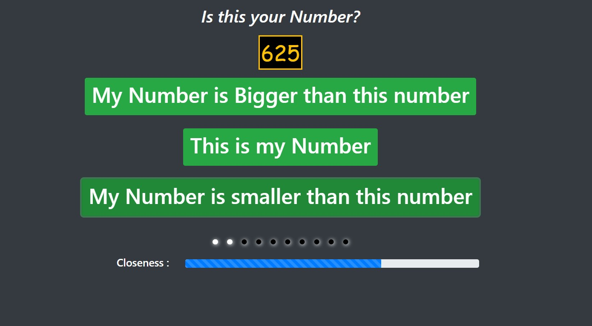
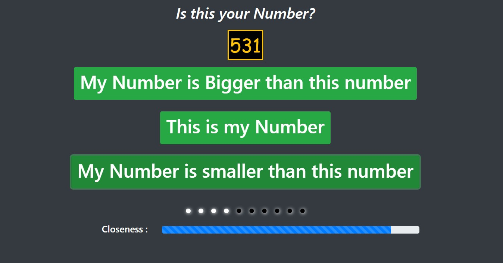
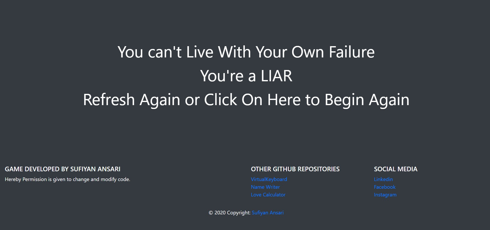

# NumberGuess

#### Hosted at this : [Click Here](https://suffisme.github.io/NumberGuess/)

### Algorithm
- It uses binary search methodology to predict your guess
- since 1000 < 1024 , log2(1024) i.e. 10 steps atmost are required to predict the number.

### Screenshots : 
- Answering Query

- Computer Guessing Right

- When You Try to change number in between

